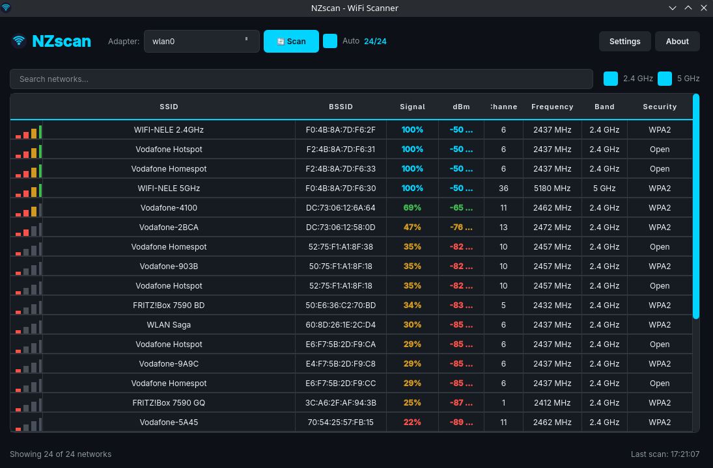
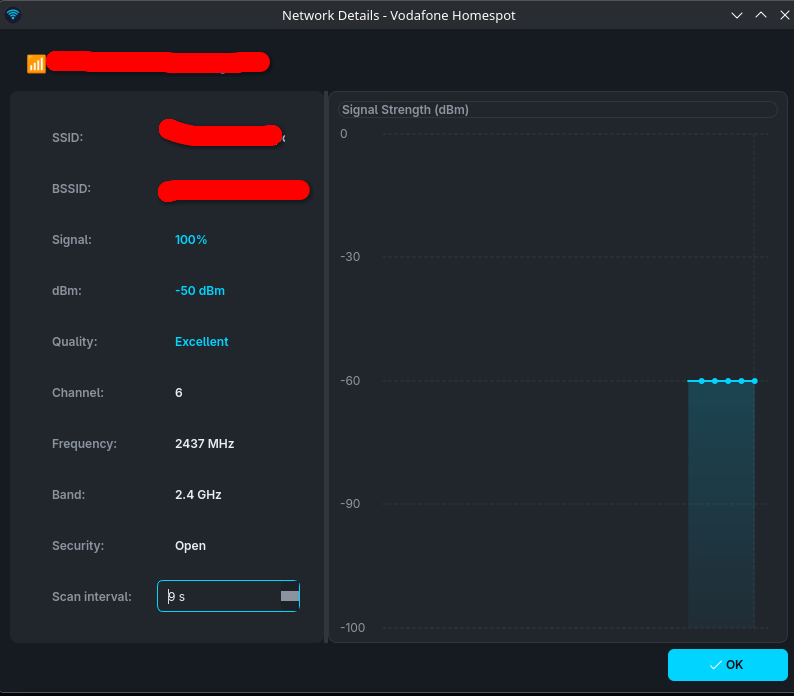

# NZscan - WiFi Scanner

<p align="center">
  <a href="https://github.com/NeleBiH/NZscan/releases">
    
  </a>
  <a href="https://github.com/NeleBiH/NZscan/blob/main/LICENSE">
    
  </a>
</p>

## Opis

NZscan je napredni WiFi skener za Linux. Aplikacija omogućuje detekciju i praćenje dostupnih WiFi mreža u realnom vremenu sa modernim UI sučeljem i podrškom za više tema.

## Screenshots

<p align="center">
  
</p>

<p align="center">
  
</p>

## Značajke

### WiFi Skeniranje
- Prikaz svih dostupnih WiFi mreža
- Informacije o svakoj mreži:
  - SSID i BSSID
  - Snaga signala (% i dBm)
  - Kanal i frekvencija
  - Pojas (2.4 GHz / 5 GHz)
  - Sigurnost (WPA2, WPA3, Open)
- Graf praćenja snage signala u vremenu
- Auto-refresh s podesivim intervalom
- Višestruki adapter podržan
- Sortiranje po koloni

### Korisničko Sučelje
- 4 teme: **Dark** (default), **Light**, **Nord**, **Dracula**
- System tray podrška
- Minimiziranje u tray umjesto zatvaranja
- Settings dijalog za konfiguraciju
- Network Details dijalog s grafom signala

## Instalacija

### Preduvjeti

- Python 3.10+
- Linux OS
- NetworkManager (`nmcli`)

### Automatska instalacija (preporučeno)

```bash
git clone https://github.com/NeleBiH/NZscan.git
cd NZscan
chmod +x setup.sh
./setup.sh
```

Skripta automatski detektira distro (apt/dnf/pacman/zypper/xbps) i instalira sve potrebne pakete.

### Ručna instalacija

1. Klonirajte repozitorij:
```bash
git clone https://github.com/NeleBiH/NZscan.git
cd NZscan
```

2. Instalirajte ovisnosti:
```bash
pip install -r requirements.txt
```

3. Pokrenite aplikaciju:
```bash
python main.py
```

## Korištenje

### Glavne Kontrole
- **🔄 Scan** - Ručno pokretanje skeniranja
- **Auto** - Uključivanje/isključivanje automatskog osvježavanja
- **Settings** - Postavke aplikacije (uključujući odabir teme)
- **About** - Informacije o aplikaciji

### Prečaci
- Dvoklik na mrežu za detaljni pregled s grafom signala
- X gumb minimizira u system tray
- Desni klik na tray ikonu za izbornik

## Konfiguracija

Postavke se čuvaju u `config.json`:
- `theme` - Tema sučelja (Dark / Light / Nord / Dracula)
- `scan_interval` - Interval skeniranja (sekunde)
- `start_minimized` - Pokreni minimiziran
- `show_signal_bars` - Prikaži signal bars
- `close_to_tray` - Minimize to tray on close
- `show_tray_notifications` - Tray notifikacije

## Tehnologije

- **PySide6** - Qt framework za Python
- **NetworkManager (nmcli)** - WiFi skeniranje

## Licenca

MIT License - pogledajte [LICENSE](LICENSE) za detalje.

## Doprinos

Pull requestovi su dobrodošli! Za veće promjene, molimo otvorite issue prvo.
